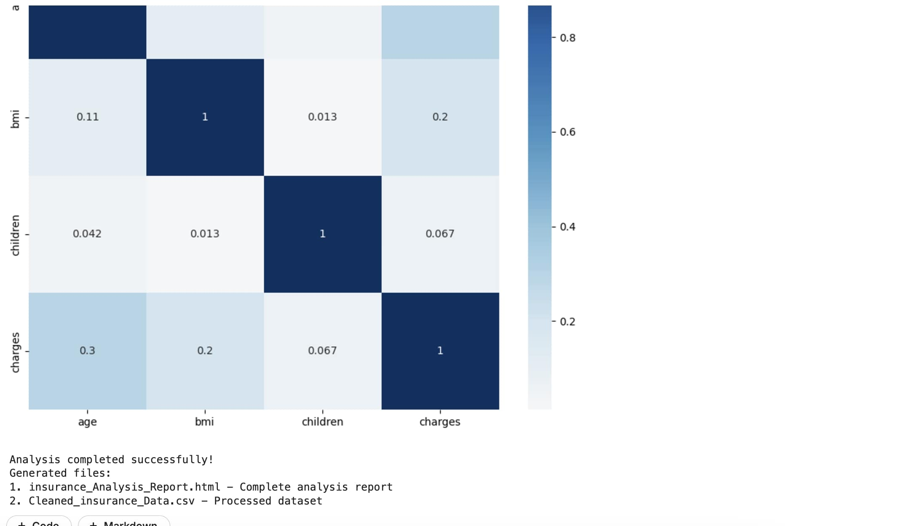

```ascii
  ____            _ _          _       _   _          
 / ___|  ___ _ __(_) |__   ___| |_   _| |_(_) ___ ___ 
 \___ \ / __| '__| | '_ \ / _ \ | | | | __| |/ __/ __|
  ___) | (__| |  | | |_) |  __/ | |_| | |_| | (__\__ \
 |____/ \___|_|  |_|_.__/ \___|_|\__, |\__|_|\___|___/
                                 |___/                
```
A versatile tool for data analysis and visualization that creates interactive HTML reports from datasets, optimized for use in Notebook environments.

## Features

- Automated data cleaning and preprocessing.
- Comprehensive statistical analysis.
- Interactive visualizations using Plotly.
- Responsive HTML report generation.
- Data quality assessment.
- Interactive data explorer with search functionality.

## Output

The tool generates two files:
1. `{dataset_name}_Analysis_Report.html` - Interactive analysis report
2. `Cleaned_{dataset_name}_Data.csv` - Processed dataset

## Report Sections

- Data Summary: Gives an overview of the dataset.
- Key Findings: Presents critical insights and patterns found.
- Univariate Analysis: Analyzes each of the variables individually.
- Bivariate Analysis: Inspects the relationship between pairs of variables.
- Data Quality Report: Identifies any inconsistencies or missing values.
- Interactive Data Explorer: A sortable table containing cleaned data.

## Future Enhancements
Currently, the script can only work with CSV files, so increasing the support for other formats such as JSON will be important. Basic methods for filling in missing values (such as mean and mode) are currently used; however, more complex imputation methods will provide extended flexibility. On larger datasets, regarding memory usage: chunk processing implementation might improve efficiency. While the script supports basic analysis methods, it would go a long way in expanding its capabilities by integrating more advanced techniques, such as regression and clustering. Equally, there is no support for time series data, so adding tools for trend analysis and forecasting would be a valuable improvement. Lastly, the script cannot process text data; adding NLP features such as tokenization and sentiment analysis, possibly powered by AI, would open up new possibilities.

## Dependencies

- pandas
- numpy
- plotly
- seaborn
- matplotlib
- IPython
- Bootstrap 5.1.3
- jQuery 3.5.1
- DataTables 1.10.24

## Screenshots





